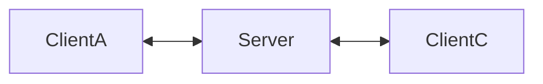

# DDS Router

This document describes the process of setting up and running the *DDS Router*, a middleware that allows the communication. 

There are two options of DDS routers:
- Zenoh
- Fast DDS

Both routers are compatible with ROS2 and can be used to connect, this document will describe how to set up and run both routers.

## Compare DDS routers
## General info
### Zenoh
Zenoh has two option of use with ROS2: 
- bridge: a standalone executable 
- plugin: a Zenoh plugin - a dynamic library that can be loaded by a Zenoh router
## Set up
### Zenoh bridge
- Add Eclipse Zenoh private repository to the sources list:
```bash
echo "deb [trusted=yes] https://download.eclipse.org/zenoh/debian-repo/ /" | sudo tee -a /etc/apt/sources.list > /dev/null
sudo apt update
```
- install the standalone executable with: `sudo apt install zenoh-bridge-ros2dds`.

    In order to build the zenoh bridge for DDS you need first to install the following dependencies:

- [Rust](https://www.rust-lang.org/tools/install). If you already have the Rust toolchain installed, make sure it is up-to-date with:

  ```bash
  rustup update
  ```

- On Linux, make sure the `llvm` and `clang` development packages are installed:
   - on Debians do: `sudo apt install llvm-dev libclang-dev`
   - on CentOS or RHEL do: `sudo yum install llvm-devel clang-devel`
   - on Alpine do: `apk install llvm11-dev clang-dev`
- [CMake](https://cmake.org/download/) (to build CycloneDDS which is a native dependency)

Once these dependencies are in place, you may clone the repository on your machine:

```bash
git clone https://github.com/eclipse-zenoh/zenoh-plugin-ros2dds.git
cd zenoh-plugin-ros2dds
rosdep install --from-paths . --ignore-src -r -y
colcon build --packages-select zenoh_bridge_ros2dds --cmake-args -DCMAKE_BUILD_TYPE=Release
```
Usage:
- On server side creat file `DEFAULT_CONFIG.json5` with:
```json5
{
  "mode": "router",
  "plugins": {
    "ros2dds": {
      "nodename": "zenoh_bridge",
      "ros_localhost_only": false
    }
  },
  "listen": {
    "endpoints": [
      "tcp/0.0.0.0:7447"
    ]
  }
}
```
and run coomand inside `zenoh-plugin-ros2dds`: 
```bash
cd ~/zenoh-plugin-ros2dds
zenoh-bridge-ros2dds -c DEFAULT_CONFIG.json5
```
Remember about IP forwarding if you are using VM and to set correct route on your main PC:
```bash
sudo sysctl -w net.ipv4.ip_forward=1
```
- On client side creat file `DEFAULT_CONFIG.json5` with:
```json5
{
  "mode": "client",
  "plugins": {
    "ros2dds": {
      "ros_localhost_only": false
    }
  },
  "connect": {
    "endpoints": [
      "tcp/public_server_addres:7447"
    ]
  }
}
```
and run coomand inside `zenoh-plugin-ros2dds`: 
```bash
cd ~/zenoh-plugin-ros2dds
zenoh-bridge-ros2dds -c DEFAULT_CONFIG.json5
```

Remeber: To connect beetwen two devices the verison of zenoh ros2dds has to be the same. To chceck vesion of bridge:
```bash
zenoh-bridge-ros2dds --version
```
### Fast DDS
#### Requirements:
- CMake, g++, pip, wget and git:
```bash
sudo apt install cmake g++ pip wget git
```
- Colcon:
```bash
pip3 install -U colcon-common-extensions vcstool
```
- Gtest:

[Gtest](https://github.com/google/googletest) is a unit testing library for C++. By default, *DDS Router* does not
compile tests. It is possible to activate them with the opportune [CMake options](https://colcon.readthedocs.io/en/released/reference/verb/build.html#cmake-options) when calling [colcon](https://colcon.readthedocs.io/en/released/) or
[CMake](https://cmake.org/). For a detailed description of the Gtest installation process, please refer to the
[Gtest Installation Guide](https://github.com/google/googletest).

- PyYAML:
```bash
pip3 install -U pyyaml
```
- jsonschema:
```bash
pip3 install -U jsonschema
```
- Asio and TinyXML2 libraries:
```bash
sudo apt install libasio-dev libtinyxml2-dev
```
- OpenSSL:
```bash
sudo apt install libssl-dev
```
- yaml-cpp:
```bash
sudo apt install libyaml-cpp-dev
```
- eProsima dependencies:

If it already exists in the system an installation of *Fast DDS* library with version greater than *2.4.0*, just source
this library when building the *DDS Router* application by using the command:

```bash
source /opt/ros/$ROS_DISTRO/setup.bash
```

In other case, just download *Fast DDS* project from sources and build it together with *DDS Router* using colcon as it
is explained in the following section.

#### Colcon installation:

1. Create a `DDS-Router` directory and download the `.repos` file that will be used to install *DDS Router* and its dependencies:

```bash
pip3 install pytest-rerunfailures
mkdir -p ~/DDS-Router/src
cd ~/DDS-Router
wget https://raw.githubusercontent.com/eProsima/DDS-Router/main/ddsrouter.repos
vcs import src < ddsrouter.repos
```

2. Build the packages:

```bash
colcon build
```


#### Create yaml file (before run)

To validate a *DDS Router* YAML configuration file, execute the following commands:

```bash
cd ~/DDS-Router
touch DDS_ROUTER_CONFIGURATION.yaml
```

Inside `DDS_ROUTER_CONFIGURATION.yaml` put your config set up

#### Run an application:
To run the *DDS Router* application, source the installation environment and execute the executable file that has been
installed in `<install-path>/ddsrouter_tool/bin/ddsrouter`:

```bash
# Source installation
source <install-path>/setup.bash

# Execute DDS Router
./<install-path>/ddsrouter_tool/bin/ddsrouter
```
# WAN connection
## DDS router (Repeater)
 To run dds router repater on server run dds router with this config:
 ```yaml
 version: v4.0

allowlist:
  - name: HelloWorldTopic
    type: HelloWorld
  - name: rt/chatter
    type: std_msgs::msg::dds_::String_

participants:
  - name: RepeaterParticipant
    kind: wan
    repeater: true
    listening-addresses:
      - ip: "server-public-ip-addres"  
        port: 11666
        transport: tcp
```
On client device run router with this config:
```yaml
version: v4.0

allowlist:
  - name: HelloWorldTopic
    type: HelloWorld
  - name: rt/chatter
    type: std_msgs::msg::dds_::String_

participants:

  - name: SimpleROS2                                              
    kind: local                                                   
    domain: 0                                                     
  - name: Client
    kind: wan
    connection-addresses:
      - ip: "server-public-ip-addres"
        port: 11666
        transport: tcp
```
Example to try, aftere runing router on very device:
- On client A device run:
```bash
ros2 run demo_nodes_cpp talker
```
- On client B device run:
```bahs
ros2 run demo_nodes_cpp listener
```
### Topology

Possible problems:
- `ROS_DOMAIN_ID`: check in bashrc if `ROS_DOMAIN_ID` it doesn't setup, if it is, delete
- `ROS_HOSTNAME=localhost`: delete this in bashrc to avoid problem with connection via WAN

## Zenoh router
- [On server install zenoh router](http://zenoh.io/docs/getting-started/installation/#ubuntu-or-any-debian-x86-64)
```bash
echo "deb [trusted=yes] https://download.eclipse.org/zenoh/debian-repo/ /" | sudo tee -a /etc/apt/sources.list > /dev/null
sudo apt update
```
- Install Zenoh
```bash
sudo apt install zenoh 
```
- Run the zenoh router in vm staring:
```
zenohd
```
- On client device in folder `zenoh-plugin-ros2dds` set up config file `DEFAULT_CONFIG.json5` with:
```json5
{
  mode: "client",

  plugins: {
    ros2dds: {
      nodename: "your_node_name",
      ros_localhost_only: false
    }
  },

  connect: {
    endpoints: [
        "<proto>/<ip>:<port>"  // of your server
    ]
  }
}
```
## Compare DDS Router with Zenoh Router
|                    | **Zenoh**                                       | **DDS (router)**                                  |
|--------------------|-------------------------------------------------|--------------------------------------------------|
| **Languages**      | Rust, C, CPP, Python, Java and Kotlin, Go        | C, CPP, Python, C#, Ada                          |
| **Transport**      | QUIC, TLS, TCP, UDP Unicats, UDP Multicast       | TCP, UDP                                         |
| **Network**        | IPv4, IPv6, 6LoWPAN                              | IPv4, IPv6                                       |
| **Data Link**      | WiFi, Ethernet, Thread, Bluetooth, Serial        | WiFi, Ethernet, Bluetooth, Serial                |
| **Support for microcontrollers** | Zenoh pico                        | Micro-XRCE-DDS                                   |
| **Protocols**      | Zenoh ,DDS, MQTT, HTTP/REST                             | DDS, RTPS                                        |
| **Efficiency**     | 20x more efficient than DDS, 10x more efficient than MQTT | -                                          |
| **Topologies**     | Clique, Mesh, Brokered, Routed                   | P2P, Router, Brokered, Multicast                 |
| **Data storage**   | S3, InfluxDB, RocksDB, File System               | Not supported, concentrates on messages routing  |
| **Security**       | mTLS, QUIC, User-Password authentication         | X.509 certificate                                |

## Work with other DDS
### Zenoh
Allows the use of any DDS (Data Distribution Service) middleware supported by ROS.
### Fast DDS
Allows the use of any DDS middleware that supports the DDSI-RTPS protocol.

## Switch from one router to another
Switch operation between two routers requires create new config files for choosed router type.

## Pros and cons
- Zenoh pros:
  - Works with other communication protocols
  - Connect different types of networks and technologies
  - Dynamic Topology
- Zenoh cons:
  - Allows QoS tuning within Zenoh and DDS, but may be limited by additional translation layer latency.

- FastDDS router pros:
  - Low latency
  - Full support of QoS

- FastDDS router cons:
  - Lack of support for others communication protocols
  - Special configuration to work with WAN
  - Less flexible in topology management compared to Zenoh

# Zenoh on server
## Zenoh server install and run
- [On server install zenoh router](http://zenoh.io/docs/getting-started/installation/#ubuntu-or-any-debian-x86-64)
```bash
echo "deb [trusted=yes] https://download.eclipse.org/zenoh/debian-repo/ /" | sudo tee -a /etc/apt/sources.list > /dev/null
sudo apt update
```
- Install Zenoh
```bash
sudo apt install zenoh 
```
- Run the zenoh router in vm staring:
```
zenohd
```
## Zenoh ros2dds plugin install and run
- install the standalone executable with: `sudo apt install zenoh-bridge-ros2dds`
- Add Eclipse Zenoh private repository to the sources list:
```bash
echo "deb [trusted=yes] https://download.eclipse.org/zenoh/debian-repo/ /" | sudo tee -a /etc/apt/sources.list > /dev/null
sudo apt update
```
- install the standalone executable with: `sudo apt install zenoh-bridge-ros2dds`.

    In order to build the zenoh bridge for DDS you need first to install the following dependencies:

- [Rust](https://www.rust-lang.org/tools/install). If you already have the Rust toolchain installed, make sure it is up-to-date with:

  ```bash
  rustup update
  ```

- On Linux, make sure the `llvm` and `clang` development packages are installed:
   - on Debians do: `sudo apt install llvm-dev libclang-dev`
   - on CentOS or RHEL do: `sudo yum install llvm-devel clang-devel`
   - on Alpine do: `apk install llvm11-dev clang-dev`
- [CMake](https://cmake.org/download/) (to build CycloneDDS which is a native dependency)

Once these dependencies are in place, you may clone the repository on your machine:

```bash
git clone https://github.com/eclipse-zenoh/zenoh-plugin-ros2dds.git
cd zenoh-plugin-ros2dds
rosdep install --from-paths . --ignore-src -r -y
colcon build --packages-select zenoh_bridge_ros2dds --cmake-args -DCMAKE_BUILD_TYPE=Release
```
### Run bridge plugin with this file `DEFAULT_CONFIG.json5`:
```json5
{
  "mode": "router",
  "plugins": {
    "ros2dds": {
      "nodename": "zenoh_bridge",
      "ros_localhost_only": false
    }
  },
  "listen": {
    "endpoints": [
      "<proto>/<ip>:<port>" "
    ]
  }
}
```
## Dashboard and ros2_automatic_action_execution
In new terminal run dashboard by:
```bash
cd ~/wisevision.proj/src/wisevision-dashboard
python3 -m app.server.run
```
In new terminal run ros2_automatic_action_exectuion:
```bash
cd ~/wisevision.proj/src/wisevision-dashboard
source /opt/ros/$ROS_DISTRO/setup.bash
ros2 run automatic_action_execution automatic_action_service 
```
## WAN Client
### Install and run Zenoh ros2dds plugin
- install the standalone executable with: `sudo apt install zenoh-bridge-ros2dds`
- Add Eclipse Zenoh private repository to the sources list:
```bash
echo "deb [trusted=yes] https://download.eclipse.org/zenoh/debian-repo/ /" | sudo tee -a /etc/apt/sources.list > /dev/null
sudo apt update
```
- install the standalone executable with: `sudo apt install zenoh-bridge-ros2dds`.

    In order to build the zenoh bridge for DDS you need first to install the following dependencies:

- [Rust](https://www.rust-lang.org/tools/install). If you already have the Rust toolchain installed, make sure it is up-to-date with:

  ```bash
  rustup update
  ```

- On Linux, make sure the `llvm` and `clang` development packages are installed:
   - on Debians do: `sudo apt install llvm-dev libclang-dev`
   - on CentOS or RHEL do: `sudo yum install llvm-devel clang-devel`
   - on Alpine do: `apk install llvm11-dev clang-dev`
- [CMake](https://cmake.org/download/) (to build CycloneDDS which is a native dependency)

Once these dependencies are in place, you may clone the repository on your machine:

```bash
git clone https://github.com/eclipse-zenoh/zenoh-plugin-ros2dds.git
cd zenoh-plugin-ros2dds
rosdep install --from-paths . --ignore-src -r -y
colcon build --packages-select zenoh_bridge_ros2dds --cmake-args -DCMAKE_BUILD_TYPE=Release
```
### Run bridge plugin with this file `DEFAULT_CONFIG.json5`:
```json5
{
  "mode": "router",
  "plugins": {
    "ros2dds": {
      "nodename": "zenoh_bridge",
      "ros_localhost_only": false
    }
  },
  "listen": {
    "endpoints": [
      "<proto>/<ip>:<port>" "
    ]
  }
}
```
### Add listne topic form terminal on client site by:
```bash
curl -X POST http://<server-public-ip>:5000/api/create_automatic_action -H "Content-Type: application/json" -d '{
    "listen_topic": "/topic_input",
    "listen_message_type": "std_msgs/msg/Int32",
    "value": "data",
    "trigger_val": "50.0",
    "trigger_type": "LessThan",
    "pub_topic": "/topic_output",
    "pub_message_type": "std_msgs/msg/String",
    "trigger_text": "test",
    "data_validity_ms": 5000
}'
```
### Run example from `ros2_automatic_action_execution` 
```bash
source /opt/ros/$ROS_DISTRO/setup.bash
mkdir -p ~/automatic_action_execution_ws/src
cd ~/automatic_action_execution_ws/src
git clone git@github.com:wise-vision/ros2_automatic_action_execution.git
cd ..
rosdep install --from-paths src --ignore-src -r -y
colcon build --symlink-install --cmake-args -DCMAKE_BUILD_TYPE=Release --packages-up-to automatic_action_execution
source install/setup.bash
ros2 run automatic_action_execution talker topic_input
```
