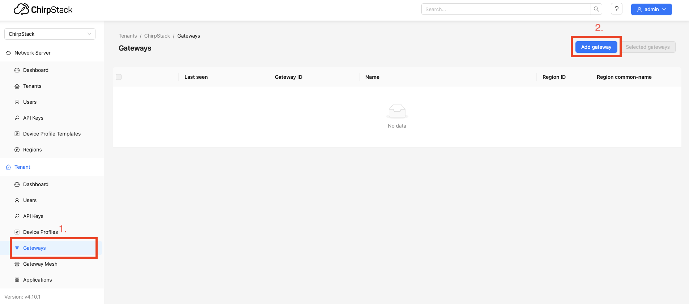

# How to set up chirpstack
## Run chirpstack in docker
1. Clone the repository:
```bash
git clone https://github.com/chirpstack/chirpstack-docker.git
cd chirpstack-docker
```
2. Run `chirpstack`:
``` bash
docker-compose up
```
## Configure chirpstack for ros2_lora_bridge
1. Start chirpstack in another terminal and open http://localhost:8080. Log in with admin/admin.
2. Set environment variables:
 - On chirpstack ui after login on the left bar go to `API keys` and than creat API key by click on the `Add API key`, provide name for API key -> genearte `API key` -> copy `API key` -> paste into `my_new_token` in command bellow and run this command
    ```
    export API_TOKEN=<my_new_token>
    ```
 - On chirpstack ui add aplication: 
    - On the left bar clic on `Application`
    - In the right corner click on `Add aplication`
    - Provide name of the application
    - On the top of the UI copy `aplication id` paste into `my_new_application_id` in command bellow and run this command
    ```
    export APPLICATION_ID=<my_new_application_id>
    ```


## How to add gateway
1. Start the gateway in another terminal: https://github.com/Lora-net/sx1302_hal
2. Start chirpstack in another terminal and open http://localhost:8080. Log in with admin/admin.
3. On the left bar click on `gateways`. (`1.` on the image below)
4. Click on the `Add gateway`. (`2.` on the image below)



5. Write name for gateway. (`1`. on the image below)
6. Write gateway EUI [How to get gateway EUI](link) (`2.` on the image below)
7. Save gateway by click `Submit` (`3.` on the image below)


## How to creat application
1. On the left bar click on `Aplications`. (`1.` on the image below)
2. Click on the `Add gateway`. (`2.` on the image below)


3. Write name for application. (`1`. on the image below)
4. Save application by click `Submit` (`2.` on the image below)


## How to create device profile
1. On the left bar click on `Device Profiles`. (`1.` on the image below)
2. Click on the `Add device profile`. (`2.` on the image below)


3. Write name for device profile(this name has to be the same name of the parser class in wisevision_lorawan_bridge for this device)(`1.` on the image below)
4. If device is class C device click on the `Class-C` (`2.` on the image below)


5. Switch `Device supports Class-C` (`1.` on the image below)
6. Save device profile by click `Submit` (`2.` on the image below)


## How to add device to application
1. On the left bar click on `Applications`. (`1.` on the image below)
2. Choose the application to add the device to. (`2.` on the image below)


3. Click on the `Add device`. (`1.` on the image below)


4. Write name for device. (`1.` on the image below)
5. Write device `EUI`. (`2.` on the image below)
6. Write device `Join EUI`. (`3.` on the image below)
7. Choose correct device profile. (`4.` on the image below)
8. Save device by click `Submit` (`5.` on the image below)

