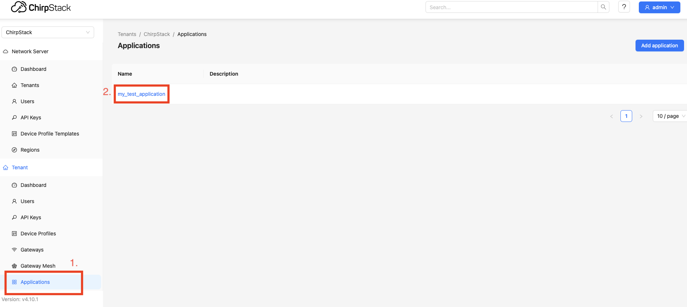

# How to set up chirpstack

Chirpstack is an open-source LoRaWAN Network Server stack. It is responsible for handling the communication between the LoRaWAN end-devices and the application server. In the WiseVision project, it is used to manage the communication between the LoRaWAN end-devices and the WiseVision bridge.

## Run chirpstack in docker

### Clone the repository:
1. Clone the repository:
```bash
vcs import --recursive < external.repos
# or directly with git
git clone https://github.com/chirpstack/chirpstack-docker.git external/chirpstack-docker
```
### Before start make changes in chirpstack-docker
1. In file `external/chirpstack-docker/configuration/chirpstack/chirpstack.toml` change last line `json=true` into `json=false`.

```bash
sed -i '/\[integration.mqtt\]/,/^$/s/json=true/json=false/' external/chirpstack-docker/configuration/chirpstack/chirpstack.toml
```

2. In file `external/chirpstack-docker/configuration/chirpstack/<your_region>.toml` For sending bigger payload for `class C` device change line with:

``` toml
# RX2 data-rate
rx2_dr=0
```
into:
``` toml
# RX2 data-rate
rx2_dr=3
```

```bash
sed -i 's/^\([[:space:]]*\)#* *rx2_dr=0/\1rx2_dr=3/' /home/adam/wisevision.proj/external/chirpstack-docker/configuration/chirpstack/<your_region>.toml
```

For the EU region, the file is `region_eu433.toml` and `region_eu868.toml`.


### Run `chirpstack`:
1. Run:
``` bash
cd external/chirpstack-docker
docker compose up 
# or for older versions docker-compose up 
```

## How to add gateway
1. Start the gateway in another terminal (if it's already set up, if not [set up gateway](set_up_gateway.md)):
``` bash
cd sx1302_hal-2.0.1/packet_forwarder
sudo ./lora_pkt_fwd
```
2. Open http://localhost:8080. Log in with admin/admin.
3. On the left bar click on `gateways`. (`1.` on the image below)
4. Click on the `Add gateway`. (`2.` on the image below)


5. Write name for gateway. (`1`. on the image below)
6. Write gateway ID (EUI) [How to get gateway ID](set_up_gateway.md#generate-gateway-id) (`2.` on the image below)
7. Save gateway by click `Submit` (`3.` on the image below)


## How to create application
1. On the left bar click on `Aplications`. (`1.` on the image below)
2. Click on the `Add gateway`. (`2.` on the image below)


3. Write name for application. (`1`. on the image below)
4. Save application by click `Submit` (`2.` on the image below)


## How to create device profile
1. On the left bar click on `Device Profiles`. (`1.` on the image below)
2. Click on the `Add device profile`. (`2.` on the image below)


3. Write name for device profile(this name has to be the same name of the parser class in wisevision_lorawan_bridge for this device)(`1.` on the image below)
4. If device is class C device click on the `Class-C` (`2.` on the image below)


5. Switch `Device supports Class-C` (`1.` on the image below)
6. Save device profile by click `Submit` (`2.` on the image below)


## How to add device to application
1. On the left bar click on `Applications`. (`1.` on the image below)
2. Choose the application to add the device to. (`2.` on the image below)



3. Click on the `Add device`. (`1.` on the image below)


4. Write name for device. (`1.` on the image below)
5. Write device `EUI`. (`2.` on the image below)
6. Write device `Join EUI`. (`3.` on the image below)
7. Choose correct device profile. (`4.` on the image below)
8. Save device by click `Submit` (`5.` on the image below)


## How to get Application id

1. On the left bar click on `Applications`. (`1.` on the image below)
2. Choose the application to get the `application ID` from. (`2.` on the image below)


3. Application id is next to app name. (`1.` on the image below)


## How to create API key

1. On the left bar click on `API keys`. (`1.` on the image below)
2. Click on the `Add API key`. (`2.` on the image below)


3. Wrtie name of the `API keys`. (`1.` on the image below)
4. Click on the `Submit`. (`2.` on the image below)


5. `API key` is here (`1.` on the image below)
6. Click on the `Submit`. (`2.` on the image below)

