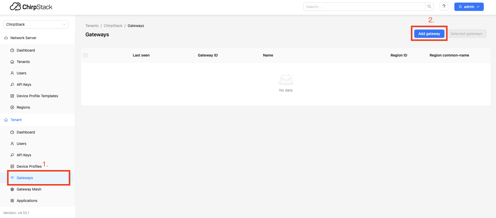
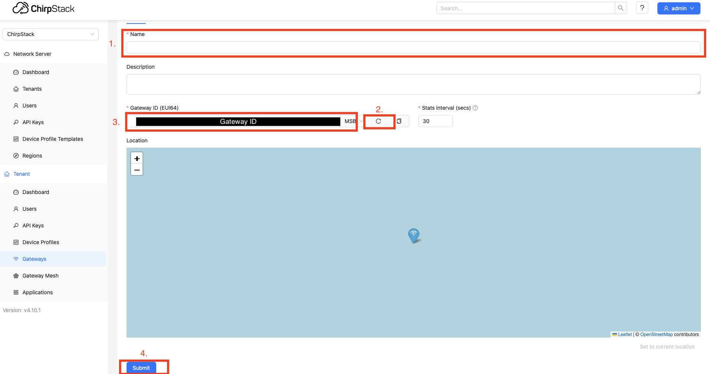

# Setting Up the LoRaWAN Gateway
## Setup Steps

NOTE: The instruction cover [LoRaWAN gateway RAK7371](https://docs.rakwireless.com/Product-Categories/WisGate/RAK7271-7371/Quickstart/#using-a-linux-machine-as-a-host) for the other gateways should be similar but it may require additional steps.


1. Install the needed make and gcc tools with the commands:
   ```bash
   sudo apt install make gcc
   ```
2. Download the archive from the Semtech Repository:
   ```bash
   wget https://github.com/Lora-net/sx1302_hal/archive/V2.0.1.tar.gz
   ```
3. After the download is complete, extract the files with the command:
   ```bash
   tar -zxvf V2.0.1.tar.gz
   ```
4. Enter the created folder:
   ```
   cd sx1302_hal-2.0.1
   ```
5. Do a make with the command:
   ```
   sudo make
   ```
6. Open the Packet forwarder folder with the following code:
   ```
   cd packet_forwarder
   ```
7. Then list the files and folders:
   ```
   ls -l
   ```
8. You can see that there is a different example configuration files for different LoRaWAN bands and different types of concentrators. In this setup, you are using RAK Developer Base, which is the USB, and the EU868 band. Run this command to rename the correct file to `global_conf.json`:
   ```
    cp global_conf.json.sx1250.EU868.USB global_conf.json
   ```
9. In your files using nano get into `global_conf.json` by:
   ```bash
   sudo nano ~/sx1302_hal/packet_forwarder/global_conf.json
   ```
   and change following lines:
   ```
   "gateway_ID": "<default ID>",
           /* change with default server address/ports */
           "server_address": "<default addres>",
           "serv_port_up": 1730,
           "serv_port_down": 1730,
   ```
   into:
   ```
   "gateway_ID": "<Gateway EUI>",
           /* change with default server address/ports */
           "server_address": "<addres_of_chirpstack>",
           "serv_port_up": 1700,
           "serv_port_down": 1700,
   ```

To Save changes press `ctrl+x` than `y` and `enter`.

If gateway is connected to machine with running chirpstack use addres: `localhost`.

### Generate Gateway ID

To generate `Gateway ID` a chirpstack is needed. Follow the steps below to generate `Gateway ID`:
- Open http://localhost:8080. Log in with admin/admin.
- On the left bar click on `gateways`. (`1.` on the image below)
- Click on the `Add gateway`. (`2.` on the image below)



- Write name for gateway. (`1`. on the image below)
- Generate gateway ID. (`2.` on the image below)
- Generated gateway ID is here. (`3.` on the image below)
- Save gateway by click `Submit` (`4.` on the image below)




10. Start packet forwarder by:
    ```bash
    sudo ./lora_pkt_fwd
    ```
